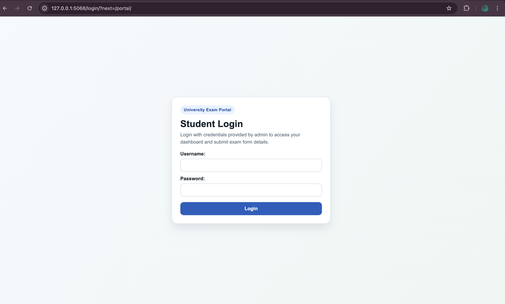
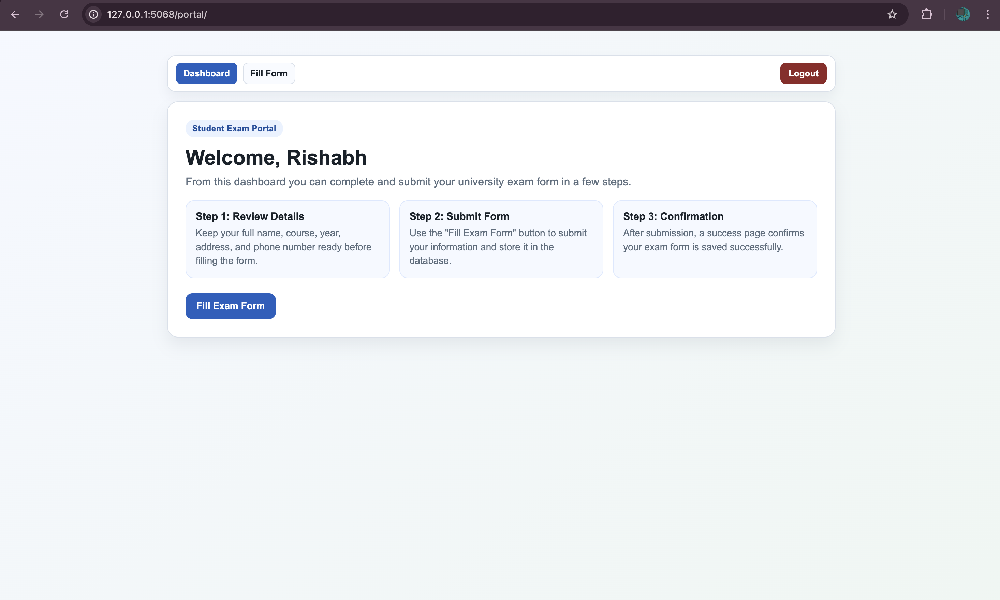
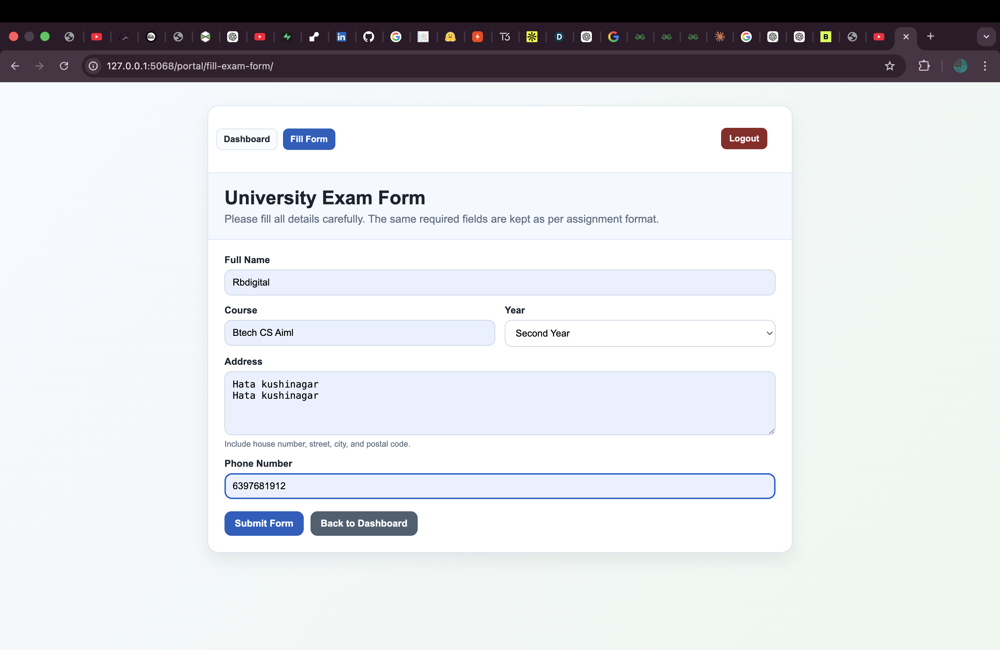
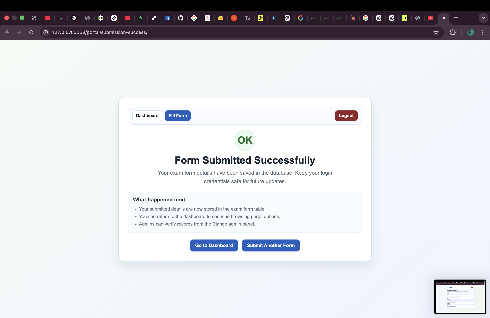
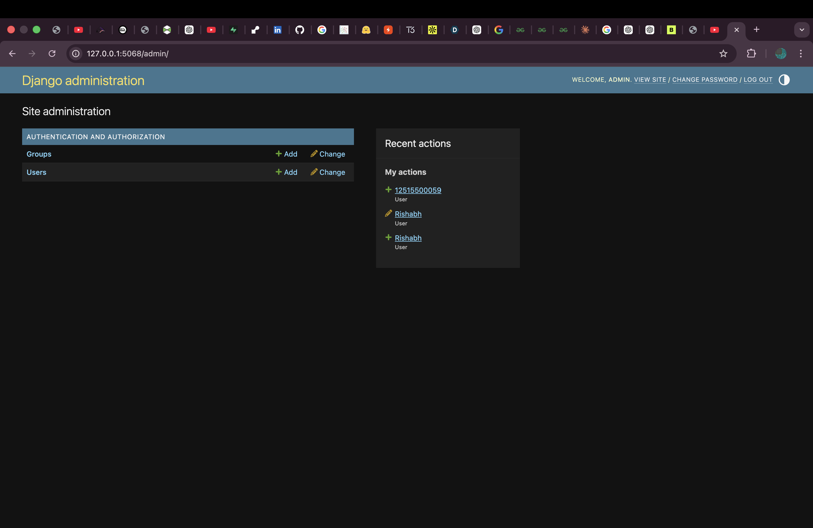
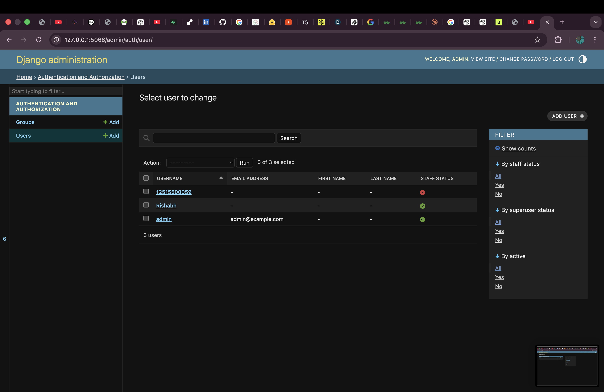

# Exam Form Full Stack Project

A Django-based student exam portal for logging in, viewing the dashboard, and submitting exam form details into a SQLite database.

## Developer

**Rishabh Barnwal**

## Live Run Details

- **Run URL:** `http://127.0.0.1:5068/`
- **Port Used:** `5068`
- **Environment:** Local development (`DEBUG=True`)

## Project Overview

This project is a simple full-stack exam form management system built with Django. It includes authentication, a student dashboard, an exam submission form, and a success page after submission. Submitted form data is stored in the database and can be reviewed through the Django admin panel.

## Features

- Student login and logout
- Protected dashboard for authenticated users
- Exam form submission with validation
- Form fields for:
  - Full name
  - Course
  - Year
  - Address
  - Phone number
- Success confirmation page after form submission
- Django admin access for managing submitted records
- Responsive and clean UI using custom HTML and CSS

## Module-Wise Workflow

### Authentication
- Student login page at `/login/`
- Logout support from all major pages
- Access protection using `@login_required`

### Student Portal
- Dashboard page at `/portal/`
- Exam form page at `/portal/fill-exam-form/`
- Submission success page at `/portal/submission-success/`

### Admin Management
- Admin panel at `/admin/`
- User and group management through Django admin
- Submitted forms can be managed from admin once model is registered

## Tech Stack

- **Backend:** Python, Django
- **Frontend:** HTML, CSS, Django Templates
- **Database:** SQLite
- **Authentication:** Django built-in auth system

## Project Structure

- `manage.py` - Django project management entry point
- `exam_portal/` - Main project configuration
  - `settings.py` - Project settings
  - `urls.py` - Main routing configuration
  - `wsgi.py` / `asgi.py` - Deployment entry points
- `examapp/` - Main application
  - `models.py` - Exam form submission model
  - `forms.py` - Model form for submission
  - `views.py` - Dashboard, form, and success views
  - `urls.py` - App routing
  - `admin.py` - Admin registration
- `templates/` - HTML templates
  - `registration/login.html`
  - `examapp/dashboard.html`
  - `examapp/fill_exam_form.html`
  - `examapp/submission_success.html`
- `db.sqlite3` - Local database file

## Core Functionalities

### 1. Login
Users must sign in before accessing the dashboard or form pages.

### 2. Dashboard
After login, the dashboard welcomes the user and provides navigation to the exam form.

### 3. Exam Form Submission
Users can fill in their details and submit the form. If the form is valid, the data is saved in the database.

### 4. Submission Success Page
A confirmation page appears after successful submission.

### 5. Admin Panel
The Django admin panel can be used to view and manage submitted records.

## Application Screenshots (Verified)

The following UI flows were validated from your shared screenshots:

1. **Login Screen**
  - URL: `/login/?next=/portal/`
  - Clean student login form with username and password fields.

2. **Dashboard**
  - URL: `/portal/`
  - Shows welcome message, workflow cards, and quick navigation.

3. **Fill Exam Form**
  - URL: `/portal/fill-exam-form/`
  - Form fields displayed correctly with submit and back actions.

4. **Submission Success**
  - URL: `/portal/submission-success/`
  - Confirmation screen displayed after successful form submission.

5. **Django Admin Home**
  - URL: `/admin/`
  - Authentication/Authorization modules visible.

6. **Django Admin Users Page**
  - URL: `/admin/auth/user/`
  - User records visible, including admin and created users.

## Screenshot Gallery

Store screenshots in `assets/screenshots/` using the filenames below to render this gallery on GitHub:

- `01-login.png`
- `02-dashboard.png`
- `03-fill-exam-form.png`
- `04-submission-success.png`
- `05-admin-home.png`
- `06-admin-users.png`

### Login Page


### Dashboard


### Fill Exam Form


### Submission Success


### Admin Home


### Admin Users


## Demo Test Credentials

Use your own created credentials. Example users seen in demo screenshots:

- `admin`
- `Rishabh`
- `12515500059`

Note: Passwords are intentionally not stored in this README.

## Database Model

The main model is `ExamFormSubmission`, which stores:

- `full_name`
- `course`
- `year`
- `address`
- `phone_number`
- `submitted_at`

## Setup Instructions

### 1. Clone the repository
```bash
git clone <repository-url>
cd assignment_fullstack
```

### 2. Create and activate virtual environment
```bash
python3 -m venv .venv
source .venv/bin/activate
```

### 3. Install dependencies
```bash
pip install django
```

### 4. Apply migrations
```bash
python manage.py migrate
```

### 5. Create a superuser
```bash
python manage.py createsuperuser
```

### 6. Run the development server
```bash
python manage.py runserver 5068
```

### 7. Open in browser
- Dashboard/admin root: `http://127.0.0.1:5068/`
- Login page: `http://127.0.0.1:5068/login/`
- Exam portal: `http://127.0.0.1:5068/portal/`
- Fill exam form: `http://127.0.0.1:5068/portal/fill-exam-form/`
- Submission success: `http://127.0.0.1:5068/portal/submission-success/`
- Django admin: `http://127.0.0.1:5068/admin/`

## Notes

- Root URL redirects to the admin page.
- The portal routes are protected using Django login required decorators.
- Form data is stored in the local SQLite database.
- The UI is customized using inline styles in the templates.

## Assignment Delivery Checklist

- Django project and app configured
- Authentication (login/logout) implemented
- Dashboard and form routes protected
- Exam form submission saved in DB
- Success confirmation page implemented
- Admin panel working
- Project verified on `localhost:5068`
- README documented with developer details and complete flow

## Future Improvements

- Add better form validation and phone number formatting
- Add search and filtering in admin
- Add download/export of submitted forms
- Add profile page for students
- Move inline CSS to static files

## License

This project is created for educational purposes.
